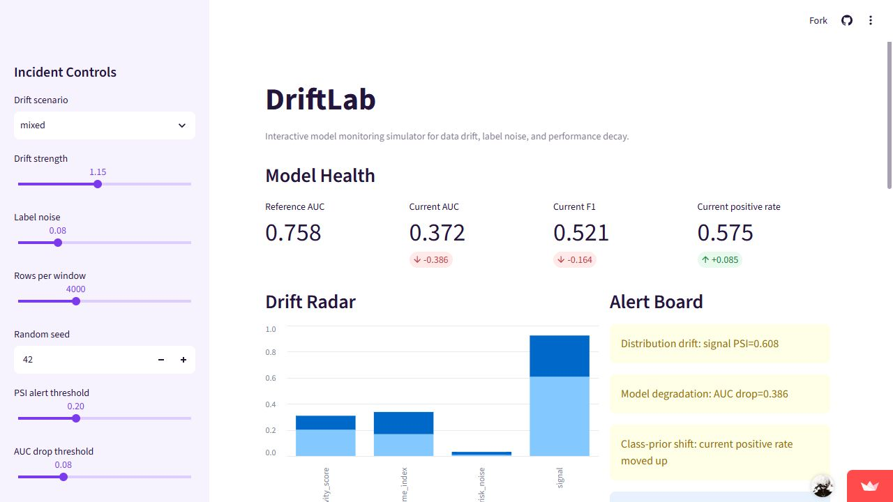
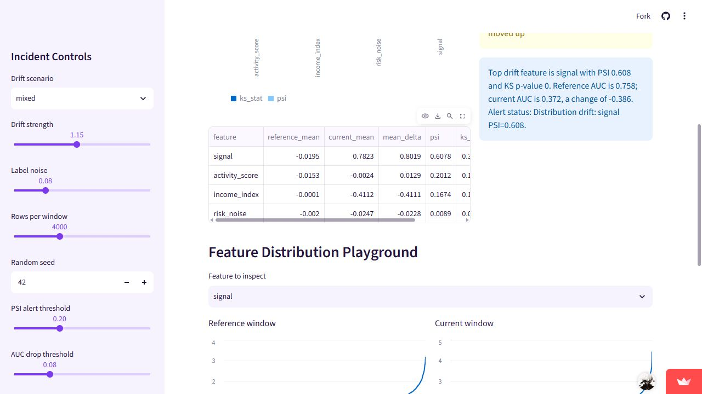

# DriftLab: Model Monitoring Simulator

[See the workflow flowchart and code walkthrough](WORKFLOW.md)

## What this product is

DriftLab is a Streamlit simulator that shows what happens when a machine
learning model receives data that no longer looks like its training data. You
can change the drift type, drift strength, label noise, sample size, and alert
thresholds from the sidebar.

The dashboard updates the model's health metrics, drift scores, feature
distributions, and alerts. It is a simple way to learn why a model can look good
at launch and then lose performance when real-world data changes.

## Live demo

[Open the verified Streamlit demo](https://yogesh-driftlab-monitoring.streamlit.app/)

You choose the drift scenario, drift strength, label noise, row count, and alert
thresholds. The app trains a small logistic regression model from scratch on a
reference window, scores a current window, and shows what changed.

It is synthetic by design. The point is not to pretend this came from a company.
The point is to show how model monitoring works when distributions move.

## Demo screenshots

### Model health and alerts

The main dashboard compares reference and current performance, then explains
which monitoring alerts were triggered.



### Feature-level drift

The diagnostics view shows which feature changed most and compares its
reference and current distributions.



## What it does

- Simulates reference and current data windows.
- Trains logistic regression with NumPy gradient descent.
- Computes accuracy, precision, recall, F1, ROC-AUC, and class rates.
- Computes feature-level PSI and approximate two-sample KS tests.
- Shows alerts for distribution drift, model degradation, and class-prior shift.
- Generates a plain-English incident summary.

## Verified demo snapshot

Generated with:

```powershell
python scripts_generate_metrics.py
```

Observed output:

```text
wrote outputs\demo_metrics.json
reference_auc=0.7576
current_auc=0.372
max_psi=0.6078
alerts=3
```

Default snapshot details:

- Reference window: `4,000` rows
- Current window: `4,000` rows
- Scenario: `mixed`
- Drift strength: `1.15`
- Label noise: `0.08`
- Max PSI: `0.6078`
- Reference AUC: `0.7576`
- Current AUC: `0.3720`
- Alerts triggered: `3`

## Run the app

```powershell
pip install -r requirements.txt
streamlit run app.py
```

## Run tests

The core logic only needs NumPy and Pandas.

```powershell
python -m unittest discover -s tests
```

Current local result:

```text
Ran 3 tests
OK
```

## Safe resume wording

Strong and honest:

> Built DriftLab, a Streamlit model-monitoring simulator that trains a NumPy
> logistic model and visualizes PSI, KS tests, AUC/F1 degradation, class-prior
> shift, and alert thresholds across configurable drift scenarios.

Also safe:

> Verified a default mixed-drift run over 4,000 reference and 4,000 current rows,
> with max PSI 0.6078, AUC moving from 0.7576 to 0.3720, and 3 alerts.

Avoid:

- Do not describe this as production monitoring.
- Do not claim real company data.
- Do not claim live deployment traffic unless it is actually deployed and measured.
