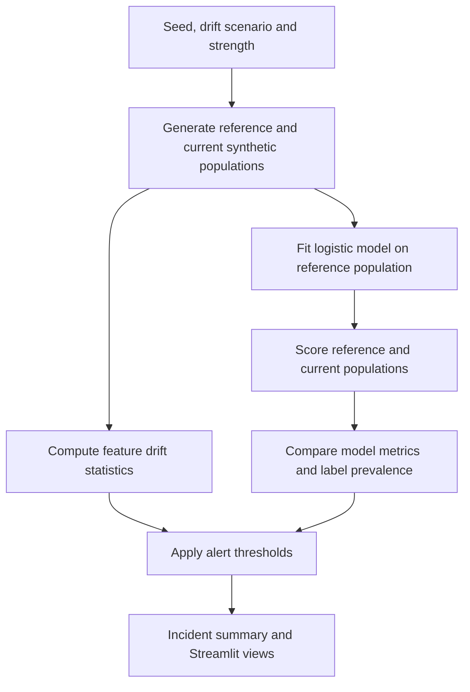

# DriftLab Monitoring Simulator: workflow

Create controlled synthetic distribution changes and inspect how drift signals and model performance react.

**Relevant roles:** data science, ML engineering.

## Flowchart

## Explain it in an interview

“I introduce a known change and check which signals respond. That lets me explain why feature drift and performance degradation are related but different, and why a drift alert alone should not automatically retrain a model.”

## What this diagram does and does not establish

Data and incidents are simulated. Reference performance is measured on the fitted reference population, so it is not an independent holdout baseline. The app illustrates monitoring logic; it does not operate a production alerting or retraining service.

## Follow the code

- [Simulation, scoring and alert logic](driftlab/simulator.py)
- [Interactive controls and results](app.py)
