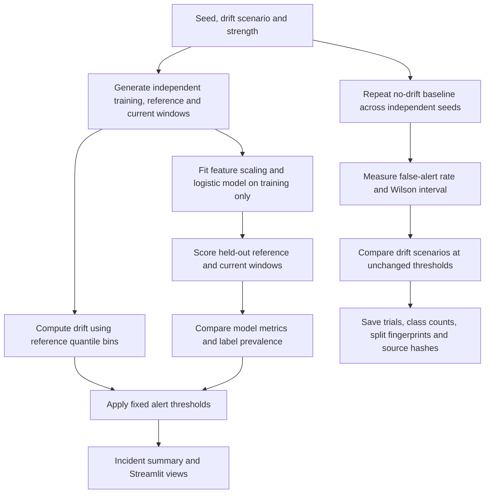

# DriftLab Monitoring Simulator: workflow

Create controlled synthetic distribution changes and inspect how drift signals and model performance react.

**Relevant roles:** data science, ML engineering.

## Flowchart

## Explain it in an interview

“I train on one synthetic window and measure baseline performance on an independent reference window. I first check how often unchanged data triggers an alert across repeated seeds. Then I introduce a known change and inspect which signals respond. This distinguishes feature drift from performance degradation and makes the false-alert uncertainty visible.”

## What this diagram does and does not establish

The model and preprocessing do not fit the reference or current windows. These are newly generated synthetic development runs, not a locked benchmark or evidence that a previous holdout was untouched. AUC requires both label classes; unavailable comparisons are explicit. The app does not operate a production alerting or retraining service.

## Follow the code and evidence

- [Simulation, independent windows, scoring and alert logic](driftlab/simulator.py)
- [Repeated no-drift and scenario benchmark](driftlab/benchmark.py)
- [Reproducible benchmark command](scripts_benchmark.py)
- [Generated report and limitations](outputs/MONITORING_BENCHMARK.md)
- [Interactive controls and results](app.py)
- [Core verification](tests/test_simulator.py) and [Streamlit checks](tests/test_app.py)
